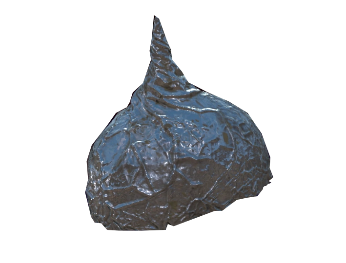

<div id="top"></div>
<!--
*** Thanks for checking out the Best-README-Template. If you have a suggestion
*** that would make this better, please fork the repo and create a pull request
*** or simply open an issue with the tag "enhancement".
*** Don't forget to give the project a star!
*** Thanks again! Now go create something AMAZING! :D
-->

<!-- PROJECT LOGO -->
<br />
<div align="center">
  <a href="https://github.com/aaf6aa/tin">
    
  </a>

<h3 align="center">Tin: a RISC-V Compiler Language</h3>

  <p align="center">
    A procedural programming language written primarily for use on RISC-V hardware.
    <br />
    <a href="https://github.com/aaf6aa/tin/wiki"><strong>Explore the docs »</strong></a>
    <br />
    <br />
    <a href="https://github.com/aaf6aa/tin/tree/main/examples">Samples</a>
    ·
    <a href="https://github.com/aaf6aa/tin/issues">Report Bug</a>
    ·
    <a href="https://github.com/aaf6aa/tin/issues">Request Feature</a>
  </p>
</div>


<!-- PROJECT SHIELDS -->
<!--
*** I'm using markdown "reference style" links for readability.
*** Reference links are enclosed in brackets [ ] instead of parentheses ( ).
*** See the bottom of this document for the declaration of the reference variables
*** for contributors-url, forks-url, etc. This is an optional, concise syntax you may use.
*** https://www.markdownguide.org/basic-syntax/#reference-style-links
-->

<div align="center">
  
  [![Contributors][contributors-shield]][contributors-url]
  [![Forks][forks-shield]][forks-url]
  [![Stargazers][stars-shield]][stars-url]
  [![Issues][issues-shield]][issues-url]
  [![MIT License][license-shield]][license-url]
  
</div>


<!-- TABLE OF CONTENTS -->
<details>
  <summary>Table of Contents</summary>
  <ol>
    <li>
      <a href="#about-the-project">About The Project</a>
      <ul>
        <li><a href="#built-with">Built With</a></li>
      </ul>
    </li>
    <li>
      <a href="#getting-started">Getting Started</a>
      <ul>
        <li><a href="#prerequisites">Prerequisites</a></li>
        <li><a href="#installation">Installation</a></li>
      </ul>
    </li>
    <li><a href="#usage">Usage</a></li>
    <li><a href="#roadmap">Roadmap</a></li>
    <li><a href="#contributing">Contributing</a></li>
    <li><a href="#license">License</a></li>
    <li><a href="#contact">Contact</a></li>
    <li><a href="#acknowledgments">Acknowledgments</a></li>
  </ol>
</details>


<!-- ABOUT THE PROJECT -->
## About The Project


Tin is a structured, imperative and procedural programming language designed around the RISC-V instruction set architecture. It is aimed mainly at applications running on embedded systems, but should be suitable for applications outside of this field.

This is a group project, originally as an assignment for the University of Lincoln. The project itself is a language built for the RISC-V architecture.

<p align="right">(<a href="#top">back to top</a>)</p>


### Built With

* [Flex 2.6.4](https://www.gnu.org/)
* [Bison 3.5.1](https://www.gnu.org/)
* [GCC](https://gcc.gnu.org/)

<p align="right">(<a href="#top">back to top</a>)</p>


<!-- GETTING STARTED -->
## Getting Started

Follow the [prerequisites](#prerequisites) and [installation](#installation) guidance to get started, once complete you are able to start making your .tin files.

### Prerequisites

Run the following command to fetch all of the required packages in order to build the toolchain:

  ```sh
  $ sudo apt-get install build-essential flex bison
  ```

### Installation

1. Clone the repo
   ```sh
   $ git clone https://github.com/aaf6aa/tin.git
   ```
2. Make the project 
   ```sh
   $ make tin
   ```
3. Compile your .tin file
   ```sh
   $ ./build/tin file-name.tin
   ```

<p align="right">(<a href="#top">back to top</a>)</p>


<!-- USAGE EXAMPLES -->
## Usage

This language is currently for the RISC-V architecture, the usage of the language an be seen in the documentation or the [examples](https://github.com/aaf6aa/tin/tree/main/examples).

_For more examples, please refer to the [documentation](https://github.com/aaf6aa/tin/wiki)_.

<p align="right">(<a href="#top">back to top</a>)</p>


<!-- ROADMAP -->
## Roadmap

- [ ] Standard Libraries
- [ ] Optimisation
- [x] Implementing #include
- [ ] Memory Tools
- [ ] Non-RISC-V Interpreter

See the [open issues](https://github.com/aaf6aa/tin/issues) for a full list of proposed features (and known issues).

<p align="right">(<a href="#top">back to top</a>)</p>


<!-- CONTRIBUTING -->
## Contributing

Contributions are what make the open source community such an amazing place to learn, inspire, and create. Any contributions you make are **greatly appreciated**.

If you have a suggestion that would make this better, please fork the repo and create a pull request. You can also simply open an issue with the tag "enhancement".
Don't forget to give the project a star! Thanks again!

1. Fork the Project
2. Create your Feature Branch (`git checkout -b feature/YourFeature`)
3. Commit your Changes (`git commit -m 'Add some YourFeature'`)
4. Push to the Branch (`git push origin feature/YourFeature`)
5. Open a Pull Request

<p align="right">(<a href="#top">back to top</a>)</p>


<!-- LICENSE -->
## License

Distributed under the MIT License. See `LICENSE.txt` for more information.

<p align="right">(<a href="#top">back to top</a>)</p>


<!-- CONTACT -->
## Contact

Hardijs Raubiskis - 25113420@students.lincoln.ac.uk

Project Link: [https://github.com/aaf6aa/tin](https://github.com/aaf6aa/tin)

<p align="right">(<a href="#top">back to top</a>)</p>


<!-- ACKNOWLEDGMENTS -->
## Acknowledgments

* [README Template](https://github.com/othneildrew/Best-README-Template)


<p align="right">(<a href="#top">back to top</a>)</p>


<!-- MARKDOWN LINKS & IMAGES -->
<!-- https://www.markdownguide.org/basic-syntax/#reference-style-links -->
[contributors-shield]: https://img.shields.io/github/contributors/aaf6aa/tin.svg?style=for-the-badge
[contributors-url]: https://github.com/aaf6aa/tin/graphs/contributors
[forks-shield]: https://img.shields.io/github/forks/aaf6aa/tin.svg?style=for-the-badge
[forks-url]: https://github.com/aaf6aa/tin/network/members
[stars-shield]: https://img.shields.io/github/stars/aaf6aa/tin.svg?style=for-the-badge
[stars-url]: https://github.com/aaf6aa/tin/stargazers
[issues-shield]: https://img.shields.io/github/issues/aaf6aa/tin.svg?style=for-the-badge
[issues-url]: https://github.com/aaf6aa/tin/issues
[license-shield]: https://img.shields.io/github/license/aaf6aa/tin.svg?style=for-the-badge
[license-url]: https://github.com/aaf6aa/tin/blob/master/LICENSE.txt
[product-screenshot]: images/screenshot.png
